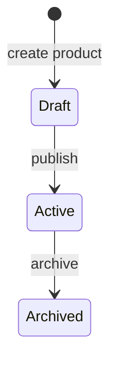
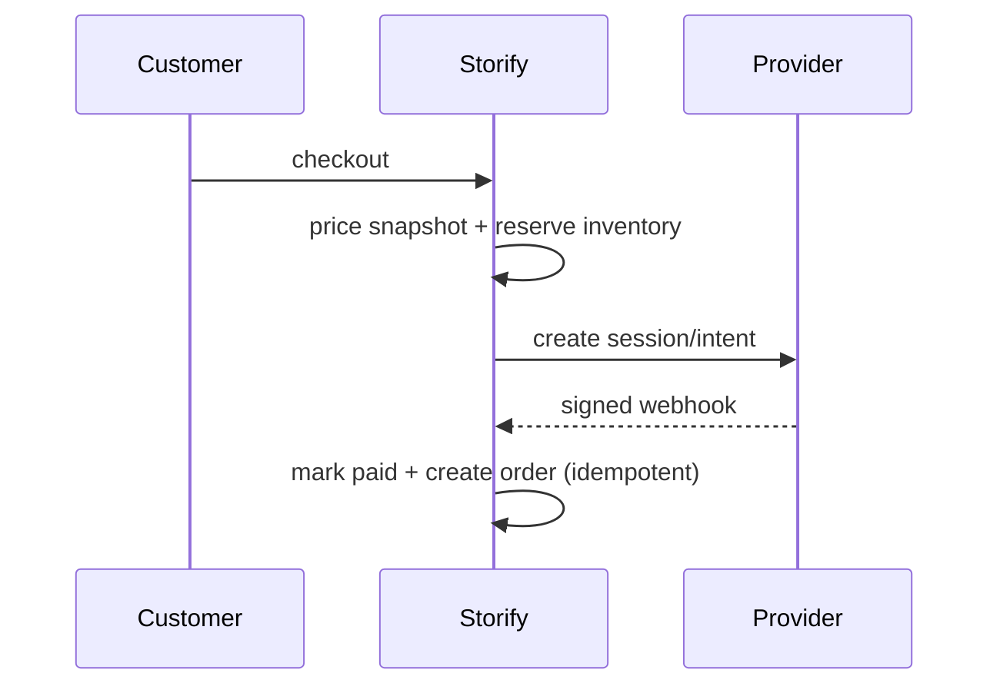

# Commerce Lifecycles

```mermaid
stateDiagram-v2
  [*] --> Draft: create product
  Draft --> Active: publish
  Active --> Archived: archive
```

```mermaid
sequenceDiagram
  participant C as Customer
  participant API as Storify
  participant Pay as Provider
  C->>API: checkout
  API->>API: price snapshot + reserve inventory
  API->>Pay: create session/intent
  Pay-->>API: signed webhook
  API->>API: mark paid + create order (idempotent)
```

Also define: cart active/abandoned; payment pending/succeeded/failed; order placed/paid/fulfilled/cancelled; return requested/approved/refunded. Subscriptions later.
